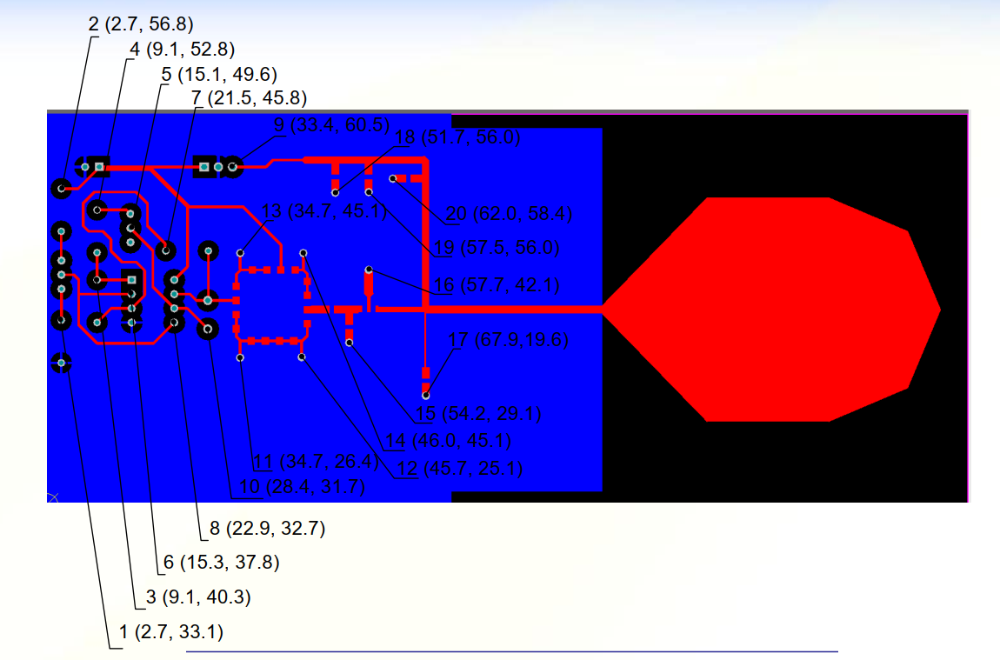

## Task Description

- Calculate the length of the shortest path and record the order of hole visits for:
  - (a) the first 8 holes
  - (b) the first 12 holes

## Problem Overview

- This task can be reduced to the Traveling Salesman Problem (TSP) with the following specifications:
  - For 8 "cities" (with 8! = 40,320 possible routes)
  - For 12 "cities" (with 12! = 479,001,600 possible routes)
- The distance between two holes is measured using the L2 norm.

## Additional Details

- The drilling tool can start from any hole (from the first 8 holes for (a) or the first 12 holes for (b)).
- In the code used to generate all permutations, include the following:
  - Calculating the length of the route
  - Comparing it with the previously found shortest route
  - Recording (output) the shortest route found.

## Instructions to Run the Code

To compile the code, use the following command in your terminal:

```bash
g++ -O3 main.cpp -o main
```

After compilation, you can run the program with:

```bash
./main
```