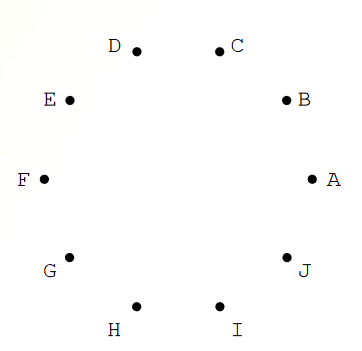
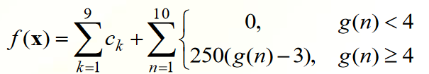

# Optimal Power Distribution Network - C++ Solution

This repository contains a C++ solution to the problem of connecting ten cities into a power distribution network while minimizing the cost of connections. The problem is outlined in Serbian, and the solution is implemented in C++.

## Problem Description

You are tasked with connecting ten cities into a power distribution network, subject to the following constraints:

- All cities must be connected.
- No closed paths (loops) are allowed in the network.
- The cost of connecting each pair of cities is given in a symmetric table.
- Creating branching from one city to four or more cities incurs a penalty cost.
- Find the optimal way to connect the cities using complete search to minimize the total cost of connections.



## Problem Input

The cost of connecting each pair of cities is given in a symmetric table, which can be represented as a two-dimensional array in C++.

```cpp
int distanceMatrix[10][10] = {
    {0, 374, 350, 223, 108, 178, 252, 285, 240, 356},
    {374, 0, 27, 166, 433, 199, 135, 95, 136, 17},
    {350, 27, 0, 41, 52, 821, 180, 201, 131, 247},
    {223, 166, 41, 0, 430, 47, 52, 84, 40, 155},
    {108, 433, 52, 430, 0, 453, 478, 344, 389, 423},
    {178, 199, 821, 47, 453, 0, 91, 37, 64, 181},
    {252, 135, 180, 52, 478, 91, 0, 25, 83, 117},
    {285, 95, 201, 84, 344, 37, 25, 0, 51, 42},
    {240, 136, 131, 40, 389, 64, 83, 51, 0, 118},
    {356, 17, 247, 155, 423, 181, 117, 42, 118, 0}
};
```

## Approach

The C++ code implements the approach mentioned in the README. It calculates the cost of each edge, generates sequences, maps sequences to trees, and performs a complete search to find the optimal solution. Based on the formula for the best cost. 




## Code

The C++ code for solving this problem is available in the `main.cpp` file in this repository. The code includes functions for calculating the cost of edges, generating sequences, mapping sequences to trees, and performing a complete search to find the optimal solution.

## Usage

To use the code, compile and run the `main.cpp` program. It will find the optimal power distribution network for the given cities and provide the minimal cost and the path (tree) connecting the cities.

## Results

The solution will contain a tree connecting the ten cities, where each edge is represented as a pair of nodes (e.g., "A B"), and the entire tree is represented as a sequence of edges separated by hyphens (e.g., "A B - C D - A D - ..."). The minimal cost of the network will also be provided.

**Note:** The solution should contain exactly nine edges (a tree with nine branches) to satisfy the problem requirements. It should be noted that this is a brute force approach.

## The optimal solution:
Minimalna cena: 389
( A E - E C - F H - G H - H J - I D - D C - C B - B J )

Time of execution: 20 seconds

## Instructions to Run the Code

To compile the code, use the following command in your terminal:

```bash
g++ -O3 main.cpp -o main
```

After compilation, you can run the program with:

```bash
./main
```
---

*This project is part of the 2023/24 school year and aims to find the optimal solution for connecting ten cities in a power distribution network while minimizing the cost of connections using C++.*

